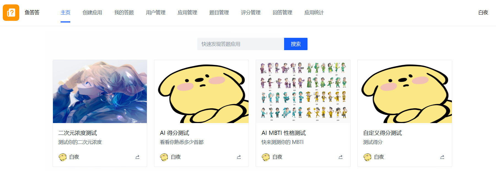
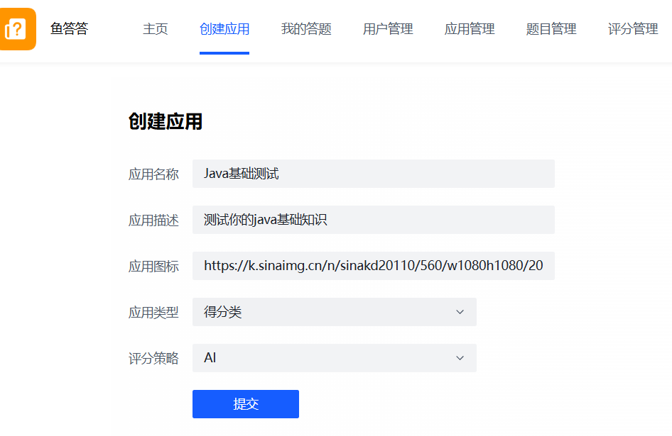
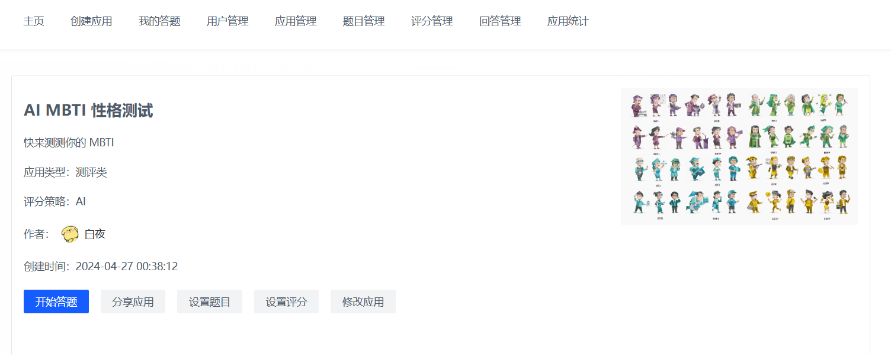
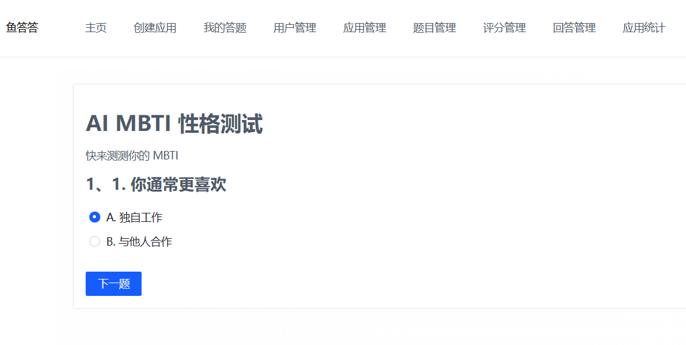
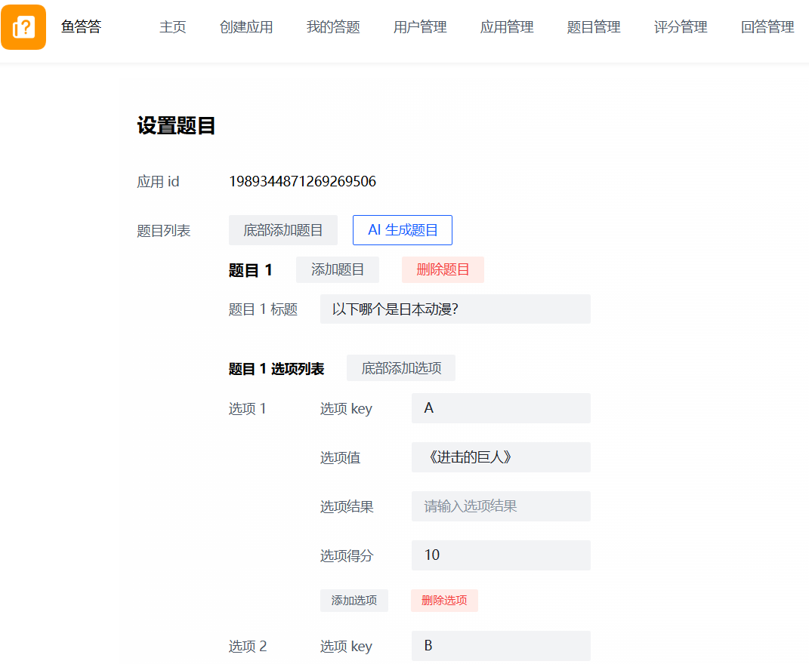
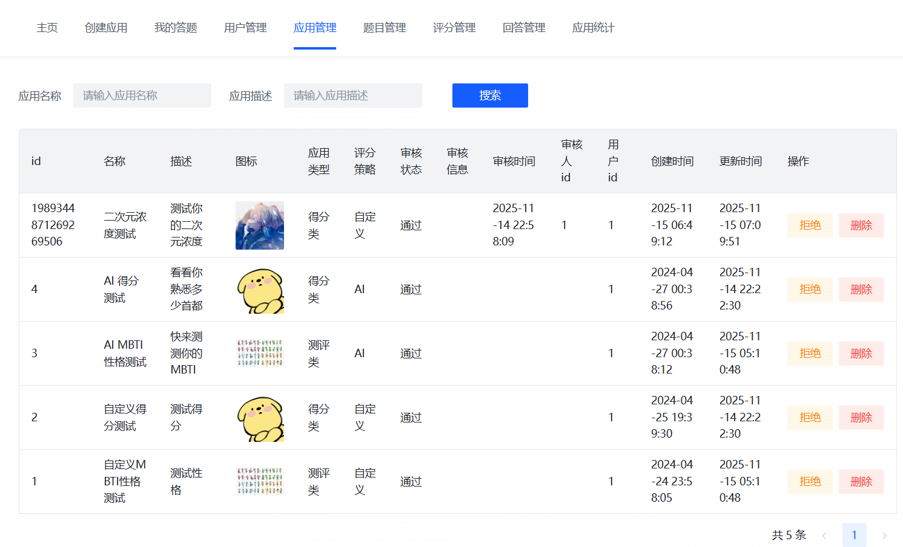
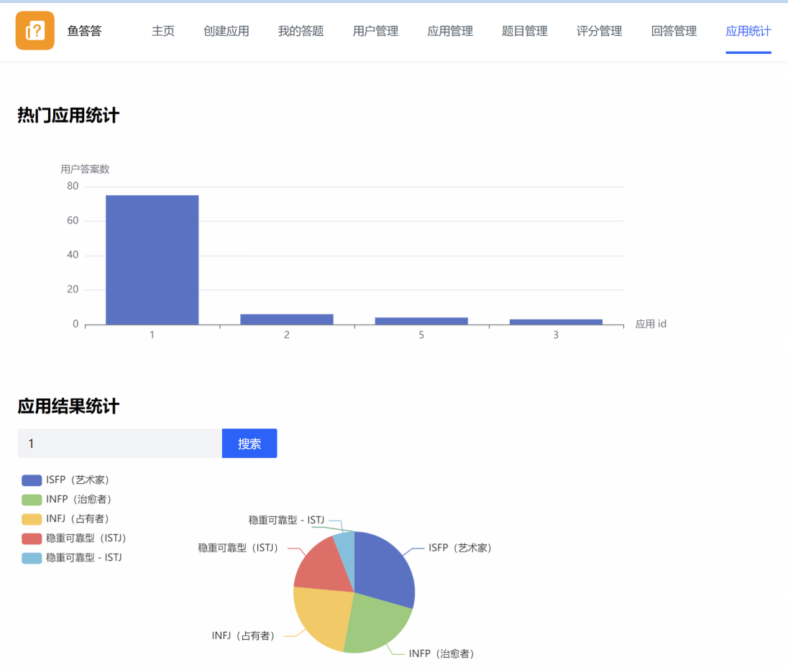
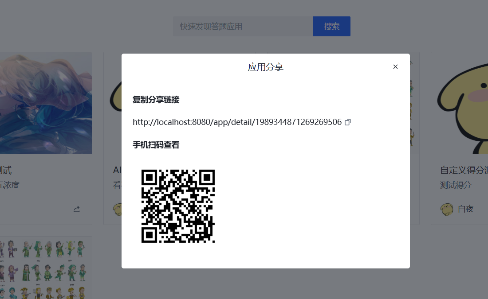

# AI答题应用平台

## 项目简介

### 项目介绍

深入业务场景的企业级实战项目，基于 Vue 3 + Spring Boot + Redis + ChatGLM AI + RxJava + SSE 的 **AI 答题应用平台。**

用户可以基于 AI 快速制作并发布多种答题应用，支持检索和分享应用、在线答题并基于评分算法或 AI 得到回答总结；管理员可以审核应用、集中管理整站内容，并进行统计分析。

### 项目展示

创建应用页：

应用详情页：

用户答题页面：

创建题目页，涉及复杂动态嵌套表单的开发：

应用管理页面：

统计分析页面：

应用分享功能：

